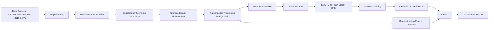
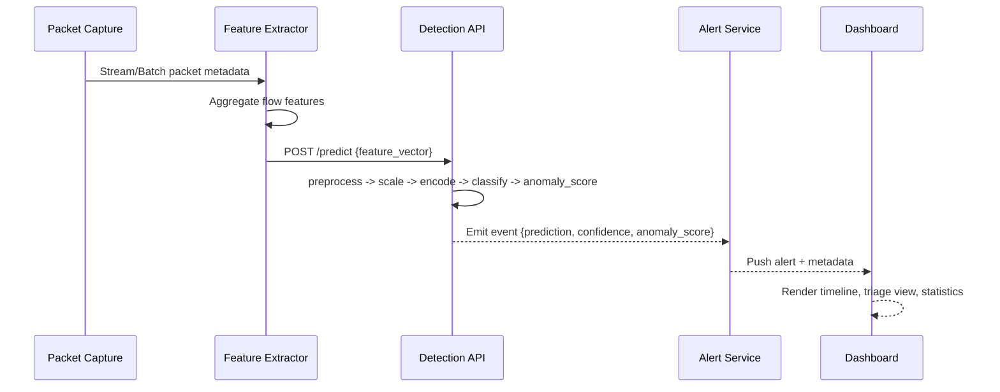

# MODEL_DETAILS: Hybrid Autoencoder + XGBoost NIDS Pipeline

## Document revision

- Date: 2026-03-16
- Revision summary:
  - Expanded into a self-contained technical disclosure for engineering and patent-drafting handoff.
  - Added reproducible preprocessing pseudocode, explicit model/training parameters, inference threshold logic, deployment patterns, and API template.
  - Added implementation appendix, alternative embodiments, operational considerations with mitigations, diagrams, and figure placeholders.

## 1. Overview: Introduction to the NIDS Model

This document describes a Network Intrusion Detection System (NIDS) implemented as a hybrid pipeline for tabular network-flow data. The system combines:

1. A feedforward autoencoder trained on benign traffic to learn compact latent representations and reconstruction behavior.
2. A supervised `XGBClassifier` trained on encoded latent vectors to classify `benign` vs `attack`.
3. A reconstruction-error threshold mechanism for anomaly-oriented scoring.

The implementation aligns with the notebook workflow in `DeepLearningModel.ipynb` and is presented here in replication-ready form.

### 1.1 End-to-end pipeline flow



### 1.2 Microservice interaction reference



## 2. Datasets: Structure and Features

The workflow supports two dataset modes.

### 2.1 CICIDS2017 mode

- Input file: `combine.csv`
- Selection key: `DATASET = "CICIDS"`
- Typical handling:
  - Label normalization to binary (`BENIGN -> 0`, others -> `1`)
  - Removal of identifier columns that do not generalize for model learning

### 2.2 UNSW-NB15 mode

- Input files:
  - `UNSW-NB15_1.csv`
  - `UNSW-NB15_2.csv`
  - `UNSW-NB15_3.csv`
  - `UNSW-NB15_4.csv`
- Selection key: `DATASET = "UNSW"`
- Combined with explicit column naming and `concat`
- Categorical columns encoded: `proto`, `service`, `state`

### 2.3 Feature groups

Representative groups include:

- Flow duration and directional packet/byte statistics
- Timing and jitter-based features
- TCP-derived timing/state metrics
- Protocol and service categorical metadata
- Binary target label (`Label`)

## 3. Preprocessing: Deterministic Data Preparation Pipeline

### 3.1 Preprocessing algorithm (replication pseudocode)

```python
# Inputs:
#   DATASET in {"CICIDS", "UNSW"}
# Outputs:
#   X_train_scaled, X_test_scaled, y_train, y_test, scaler.joblib, selected_feature_schema

import os
import random
import joblib
import numpy as np
import pandas as pd
import tensorflow as tf
from sklearn.model_selection import train_test_split
from sklearn.preprocessing import LabelEncoder, StandardScaler

# 1) Set deterministic seeds
SEED = 42
os.environ["PYTHONHASHSEED"] = str(SEED)
random.seed(SEED)
np.random.seed(SEED)
tf.random.set_seed(SEED)

# 2) Load dataset
if DATASET == "CICIDS":
    data = pd.read_csv("./combine.csv")
elif DATASET == "UNSW":
    unsw_files = [
        "./UNSW-NB15_1.csv", "./UNSW-NB15_2.csv",
        "./UNSW-NB15_3.csv", "./UNSW-NB15_4.csv"
    ]
    unsw_columns = [...]  # explicit UNSW schema as used in notebook
    frames = [pd.read_csv(f, header=None, names=unsw_columns, low_memory=False) for f in unsw_files]
    data = pd.concat(frames, ignore_index=True)
else:
    raise ValueError("DATASET must be 'CICIDS' or 'UNSW'")

# 3) Normalize column names
data.columns = data.columns.str.strip()

# 4) Drop columns
if DATASET == "CICIDS":
    drop_cols = [
        "Unnamed: 0", "Flow ID", "Source IP", "Destination IP",
        "Timestamp", "Source Port", "Destination Port", "Protocol"
    ]
    data = data.drop(columns=drop_cols, errors="ignore")
else:  # UNSW
    data = data.drop(columns=["srcip", "dstip", "attack_cat"], errors="ignore")

# 5) Normalize label to binary
if DATASET == "CICIDS":
    data["Label"] = data["Label"].apply(lambda x: 0 if str(x).strip().upper() == "BENIGN" else 1)
else:
    data["Label"] = pd.to_numeric(data["Label"], errors="coerce").fillna(0).astype(int)
    data["Label"] = data["Label"].apply(lambda x: 1 if x == 1 else 0)

# 6) Replace inf with NaN
data = data.replace([np.inf, -np.inf], np.nan)

# 7) Categorical encoding for UNSW columns
if DATASET == "UNSW":
    for col in ["proto", "service", "state"]:
        if col in data.columns:
            data[col] = data[col].fillna("missing").astype(str)
            le = LabelEncoder()
            data[col] = le.fit_transform(data[col])

# 8) Median imputation for numeric columns
numeric_cols = data.select_dtypes(include=[np.number]).columns
for col in numeric_cols:
    data[col] = data[col].fillna(data[col].median())

# 9) Split features/label
X = data.drop(columns=["Label"])
y = data["Label"]

# 10) Train-test split with stratify
X_train_raw, X_test_raw, y_train, y_test = train_test_split(
    X, y, test_size=0.25, random_state=SEED, stratify=y
)

# 11) Ensure numeric feature matrix only
non_numeric_cols = X_train_raw.select_dtypes(exclude=[np.number]).columns.tolist()
if non_numeric_cols:
    X_train_raw = X_train_raw.drop(columns=non_numeric_cols)
    X_test_raw = X_test_raw.drop(columns=non_numeric_cols)

# 12) Correlation filtering on X_train only
corr_train = X_train_raw.corr()
upper_triangle = corr_train.where(np.triu(np.ones(corr_train.shape), k=1).astype(bool))
to_drop = [
    column for column in upper_triangle.columns
    if any(abs(upper_triangle[column]) > 0.9)
]
X_train_raw = X_train_raw.drop(columns=to_drop, errors="ignore")
X_test_raw = X_test_raw.drop(columns=to_drop, errors="ignore")

# 13) Fit scaler on train and transform train/test
scaler = StandardScaler()
X_train_scaled = scaler.fit_transform(X_train_raw)
X_test_scaled = scaler.transform(X_test_raw)

# 14) Persist preprocessing artifact
joblib.dump(scaler, "scaler.joblib")

# Optional: persist schema metadata for inference consistency
selected_feature_schema = list(X_train_raw.columns)
```

### 3.2 Preprocessing rationale

- `stratify=y` preserves class proportions for evaluation stability.
- Correlation filtering is executed on training data only to avoid leakage.
- Standardization stabilizes neural training and latent-space geometry.
- Column dropping removes high-cardinality identifiers that can cause overfitting and privacy exposure.

## 4. Models: Architecture and Hyperparameters

### 4.1 Autoencoder architecture

The implemented autoencoder is fully connected and L2-regularized:

- Input: `input_dim = X_train_benign.shape[1]`
- Encoder:
  - `Dense(30, activation='relu', kernel_regularizer=l2(0.001))`
  - `Dense(10, activation='relu', kernel_regularizer=l2(0.001))`
  - `Dense(5, activation='relu', kernel_regularizer=l2(0.001))`  # bottleneck
- Decoder:
  - `Dense(15, activation='relu', kernel_regularizer=l2(0.001))`
  - `Dense(30, activation='relu', kernel_regularizer=l2(0.001))`
  - `Dense(input_dim, activation='linear')`

Compile settings:

- Optimizer: `Adam(learning_rate=1e-5)`
- Loss: `mean_squared_error`

Training settings:

- Epochs: `100`
- Batch size: `1024`
- Validation: benign holdout (`validation_data=(X_val_benign, X_val_benign)`)
- Early stopping:
  - `monitor='val_loss'`
  - `patience=10`
  - `restore_best_weights=True`

Design intent:

- Narrow bottleneck (`5`) enforces compact latent coding.
- `relu` supports sparse, nonlinear projection for tabular inputs.
- L2 regularization (`0.001`) mitigates large-weight memorization.
- Low learning rate (`1e-5`) improves optimization stability on scaled tabular signals.

### 4.2 Encoder extraction procedure

After fitting the autoencoder, extract the encoder graph endpoint using the bottleneck tensor:

```python
from tensorflow.keras.models import Model

# 'encoded' is the bottleneck tensor defined in the autoencoder graph
encoder_model = Model(inputs=autoencoder.input, outputs=encoded)
encoder_model.save("encoder_model.h5")

X_train_encoded = encoder_model.predict(X_train_scaled)
X_test_encoded = encoder_model.predict(X_test_scaled)
```

### 4.3 SMOTE usage (training only)

SMOTE is applied after latent feature generation and before classifier fit:

```python
from imblearn.over_sampling import SMOTE

smote = SMOTE(random_state=42)
X_train_encoded_smote, y_train_smote = smote.fit_resample(X_train_encoded, y_train)
```

Operational rule:

- Apply SMOTE to training features only.
- Do not apply SMOTE to validation/test/inference traffic.

### 4.4 XGBoost classifier and parameters

Implemented classifier:

```python
from xgboost import XGBClassifier

xgb_model = XGBClassifier(
    n_estimators=100,
    max_depth=5,
    learning_rate=0.1,
    subsample=0.8,
    colsample_bytree=0.8,
    random_state=42
)
xgb_model.fit(X_train_encoded_smote, y_train_smote)
```

Parameter rationale:

| Parameter | Value | Technical intent |
|---|---:|---|
| `n_estimators` | `100` | Ensemble capacity without excessive training cost |
| `max_depth` | `5` | Balance nonlinearity and over-complex trees |
| `learning_rate` | `0.1` | Stable gradient boosting step size |
| `subsample` | `0.8` | Row subsampling for regularization |
| `colsample_bytree` | `0.8` | Feature subsampling for diversity and regularization |
| `random_state` | `42` | Reproducible stochastic behavior |

## 5. Training: End-to-End Workflow

### 5.1 Ordered training procedure

1. Load CSV data according to `DATASET` selector.
2. Standardize columns and drop non-generalizing identifiers.
3. Normalize labels to binary classes.
4. Replace `inf/-inf` with `NaN` and impute numeric medians.
5. Encode UNSW categorical columns (`proto`, `service`, `state`).
6. Perform stratified train/test split (`test_size=0.25`, `random_state=42`).
7. Remove non-numeric columns if present post-split.
8. Apply correlation filtering from `X_train_raw` with threshold `|corr| > 0.9`.
9. Fit `StandardScaler` on train and transform train/test.
10. Subselect benign train rows for autoencoder fitting.
11. Split benign train/validation (`test_size=0.25`, `random_state=42`).
12. Train autoencoder with early stopping.
13. Save autoencoder and extracted encoder.
14. Encode train/test via encoder model.
15. Apply SMOTE to encoded train only.
16. Train XGBoost on SMOTE-balanced latent train.
17. Evaluate on untouched encoded test split.
18. Save all artifacts.

### 5.2 Reproducibility controls

Set seeds in all frameworks used by stochastic procedures:

```python
import os, random, numpy as np, tensorflow as tf
SEED = 42
os.environ["PYTHONHASHSEED"] = str(SEED)
random.seed(SEED)
np.random.seed(SEED)
tf.random.set_seed(SEED)
```

Additional reproducibility recommendation:

- Persist feature schema and preprocessing configuration alongside model files.
- Record package versions and git commit hash in training metadata.

## 6. Evaluation: Metrics, Thresholding, and Visual Diagnostics

### 6.1 Classification metrics

Evaluate on `X_test_encoded` and `y_test`:

- `classification_report` (precision, recall, F1)
- confusion matrix
- ROC curve and `AUC`
- precision-recall curve

TODO placeholders to complete after experiment runs:

- `TODO: Insert final training loss = <value>`
- `TODO: Insert final validation loss = <value>`
- `TODO: Insert ROC AUC = <value>`
- `TODO: Insert precision/recall per class = <values>`
- `TODO: Insert confusion matrix snapshot path`

### 6.2 Reconstruction error scoring and thresholding

Compute anomaly score as per-sample MSE reconstruction error.

Given scaled input vector $x_i \in \mathbb{R}^{d}$ and reconstruction $\hat{x}_i$:

$$
\text{anomaly\_score}_i = e_i = \frac{1}{d}\sum_{j=1}^{d} (x_{ij} - \hat{x}_{ij})^2
$$

Procedure:

```python
# 1) Compute benign training reconstruction errors
recon_train_benign = autoencoder.predict(X_train_benign)
benign_train_errors = np.mean(np.square(recon_train_benign - X_train_benign), axis=1)

# 2) Select threshold from benign distribution
threshold = np.percentile(benign_train_errors, 95)

# 3) Compute errors on inference/test samples
reconstructions = autoencoder.predict(X_test_scaled)
reconstruction_errors = np.mean(np.square(reconstructions - X_test_scaled), axis=1)

# 4) Flag anomaly candidates
anomaly_flags = (reconstruction_errors > threshold).astype(int)
```

Inference-time use:

- Return both classifier output and `anomaly_score`.
- Generate elevated alert priority when `prediction == attack` and `anomaly_score > threshold`.

### 6.3 Figure placeholders for technical review/patent draft package

- `docs/figures/training-loss-plot.png`
  - Should show autoencoder train/validation loss over epochs and early-stop epoch.
- `docs/figures/confusion-matrix.png`
  - Should show class-level confusion counts and normalized rates.
- `docs/figures/roc-pr-plot.png`
  - Should show ROC and precision-recall curves for test set.
- `docs/figures/reconstruction-error-hist.png`
  - Should show benign/attack error distributions and 95th percentile threshold marker.
- `docs/figures/pca-latent-space.png`
  - Should show 2D PCA projection of encoded test features by class label.

## 7. Artifacts: Files, Storage, and Versioning

### 7.1 Persisted artifacts

| Artifact | Filename | Purpose | Suggested path |
|---|---|---|---|
| Scaler | `scaler.joblib` | Standardization transform | `artifacts/preprocessing/scaler.joblib` |
| Autoencoder | `autoencoder_xg_model.h5` | Reconstruction model for anomaly scoring | `artifacts/models/autoencoder_xg_model.h5` |
| Encoder | `encoder_model.h5` | Latent feature extractor | `artifacts/models/encoder_model.h5` |
| Classifier | `xgb_model.joblib` | Final supervised predictor | `artifacts/models/xgb_model.joblib` |

### 7.2 Artifact manifest recommendation

Store a machine-readable manifest with:

- `artifact_version`
- training timestamp
- dataset mode (`CICIDS` or `UNSW`)
- selected feature list and order
- random seed
- package versions
- threshold value

Example file: `artifacts/manifest.json`

## 8. Deployment: Environment, API Pattern, and Runtime Envelope

### 8.1 Required environment (recommended)

- Python: `3.10` (or `3.9+` with validated compatibility)
- OS: Linux or Windows with consistent library wheels

Minimal `requirements.txt` template:

```txt
tensorflow==2.15.0
scikit-learn==1.4.2
pandas==2.2.2
numpy==1.26.4
matplotlib==3.8.4
seaborn==0.13.2
xgboost==2.0.3
imbalanced-learn==0.12.3
joblib==1.4.2
fastapi==0.111.0
uvicorn==0.30.1
```

### 8.2 Representative hardware and training duration estimates

These are qualitative planning estimates and should be benchmarked in target infrastructure.

| Dataset scale (rows x features) | Hardware profile | Approximate training time |
|---|---|---|
| `~100k x 50` | 8 vCPU, 16 GB RAM, CPU-only | ~5 to 20 minutes |
| `~500k x 50` | 16 vCPU, 32 GB RAM, CPU-only | ~20 to 90 minutes |
| `~1M x 50` | 16 vCPU + mid-range GPU (optional), 32+ GB RAM | ~30 to 120 minutes |

Notes:

- Autoencoder fit time typically dominates on larger datasets.
- XGBoost time scales with latent sample count and parameter choices.

### 8.3 Detection API interaction (high level)

1. Validate incoming feature payload schema.
2. Align feature order to persisted schema.
3. Apply scaler transform.
4. Encode via encoder model.
5. Predict class and confidence via XGBoost.
6. Compute reconstruction anomaly score via autoencoder.
7. Compare score to persisted threshold.
8. Return response with model/artifact version metadata.

## 9. Extensions: Alternative Embodiments, Operational Considerations, and Ethics

### 9.1 Alternative embodiments

The following options preserve the technical core (learned representation + supervised decision + anomaly signal), while changing implementation details:

- Replace feedforward autoencoder with a denoising autoencoder.
- Replace autoencoder with variational autoencoder (VAE) for probabilistic latent space modeling.
- Replace encoder with contrastive representation learning module.
- Add temporal modeling stage (`LSTM` or Transformer) over session/window sequences.
- Replace SMOTE with class-weighted objective functions or focal loss variants.
- Use online/incremental learning for classifier adaptation.
- Add model explainability layer (for example SHAP) for triage support.
- Use ensemble detectors combining reconstruction error, XGBoost confidence, and rule-based signatures.

### 9.2 Operational considerations and mitigations

| Operational consideration | Implementation mitigation |
|---|---|
| Benign traffic distributions evolve over time | Schedule retraining cadence and monitor feature drift statistics |
| Threshold sensitivity varies by environment | Calibrate percentile threshold per deployment and update with validation windows |
| Class ratio shifts in production streams | Monitor base-rate drift and re-balance training data or class weights |
| Single-model dependency | Use ensemble fallback and health checks for model outputs |
| Inference schema mismatch risk | Enforce strict schema validation and feature-order manifest checks |
| Evolving attack techniques | Add periodic red-team datasets and incremental retraining cycles |

### 9.3 Data provenance and ethics

- Data sources: CICIDS2017-derived combined CSV and UNSW-NB15 split CSV files.
- Identifier minimization: IP address columns (`srcip`, `dstip`, and analogous flow identifiers) are removed in preprocessing to reduce direct personally identifying linkage.
- Responsible use: deploy only after controlled validation, security review, and environment-specific testing; treat model outputs as decision-support signals requiring operational verification.

## 10. Implementation appendix

### 10.1 Representative training snippets

#### A) Train autoencoder

```python
from tensorflow.keras.models import Model
from tensorflow.keras.layers import Input, Dense
from tensorflow.keras.optimizers import Adam
from tensorflow.keras.regularizers import l2
from tensorflow.keras.callbacks import EarlyStopping

input_dim = X_train_benign.shape[1]
input_layer = Input(shape=(input_dim,))
encoded = Dense(30, activation="relu", kernel_regularizer=l2(0.001))(input_layer)
encoded = Dense(10, activation="relu", kernel_regularizer=l2(0.001))(encoded)
encoded = Dense(5, activation="relu", kernel_regularizer=l2(0.001))(encoded)
decoded = Dense(15, activation="relu", kernel_regularizer=l2(0.001))(encoded)
decoded = Dense(30, activation="relu", kernel_regularizer=l2(0.001))(decoded)
decoded = Dense(input_dim, activation="linear")(decoded)

autoencoder = Model(inputs=input_layer, outputs=decoded)
autoencoder.compile(optimizer=Adam(learning_rate=1e-5), loss="mean_squared_error")

early_stop = EarlyStopping(monitor="val_loss", patience=10, restore_best_weights=True)

history = autoencoder.fit(
    X_train_benign,
    X_train_benign,
    epochs=100,
    batch_size=1024,
    validation_data=(X_val_benign, X_val_benign),
    callbacks=[early_stop],
    verbose=1,
)
```

#### B) Extract encoder and generate latent features

```python
encoder_model = Model(inputs=autoencoder.input, outputs=encoded)
encoder_model.save("encoder_model.h5")

X_train_encoded = encoder_model.predict(X_train_scaled)
X_test_encoded = encoder_model.predict(X_test_scaled)
```

#### C) Apply SMOTE and train XGBoost

```python
from imblearn.over_sampling import SMOTE
from xgboost import XGBClassifier

smote = SMOTE(random_state=42)
X_train_encoded_smote, y_train_smote = smote.fit_resample(X_train_encoded, y_train)

xgb_model = XGBClassifier(
    n_estimators=100,
    max_depth=5,
    learning_rate=0.1,
    subsample=0.8,
    colsample_bytree=0.8,
    random_state=42,
)
xgb_model.fit(X_train_encoded_smote, y_train_smote)
```

#### D) Save artifacts and threshold

```python
import json
import joblib
import numpy as np

joblib.dump(scaler, "scaler.joblib")
autoencoder.save("autoencoder_xg_model.h5")
encoder_model.save("encoder_model.h5")
joblib.dump(xgb_model, "xgb_model.joblib")

recon_train_benign = autoencoder.predict(X_train_benign)
benign_train_errors = np.mean(np.square(recon_train_benign - X_train_benign), axis=1)
threshold = float(np.percentile(benign_train_errors, 95))

manifest = {
    "artifact_version": "v1.0.0",
    "threshold": threshold,
    "seed": 42,
    "dataset_mode": DATASET,
}
with open("artifacts/manifest.json", "w", encoding="utf-8") as f:
    json.dump(manifest, f, indent=2)
```

### 10.2 Inference flow pseudocode (API-side)

```python
# Pseudocode for request-time detection

def predict_one(feature_dict):
    assert schema_is_valid(feature_dict)

    x = reorder_to_training_schema(feature_dict, feature_order)
    x_scaled = scaler.transform([x])

    z = encoder_model.predict(x_scaled)
    pred = int(xgb_model.predict(z)[0])
    conf = float(xgb_model.predict_proba(z)[0][1])

    x_recon = autoencoder.predict(x_scaled)
    anomaly_score = float(np.mean((x_recon - x_scaled) ** 2))
    anomaly_flag = int(anomaly_score > threshold)

    return {
        "prediction": pred,
        "confidence": conf,
        "anomaly_score": anomaly_score,
        "anomaly_flag": anomaly_flag,
        "artifact_version": artifact_version,
    }
```

### 10.3 Minimal FastAPI `/predict` template

```python
from typing import Dict, Any
from fastapi import FastAPI, HTTPException
from pydantic import BaseModel, Field
import joblib
import numpy as np
from tensorflow.keras.models import load_model

app = FastAPI(title="NIDS Detection API", version="1.0.0")

# Load artifacts at startup
scaler = joblib.load("artifacts/preprocessing/scaler.joblib")
autoencoder = load_model("artifacts/models/autoencoder_xg_model.h5")
encoder_model = load_model("artifacts/models/encoder_model.h5")
xgb_model = joblib.load("artifacts/models/xgb_model.joblib")

feature_order = [
    # TODO: insert exact ordered feature keys from training schema
    # "dur", "sbytes", "dbytes", ...
]
threshold = 0.0  # TODO: load from manifest.json
artifact_version = "v1.0.0"  # TODO: load from manifest.json

class PredictRequest(BaseModel):
    features: Dict[str, float] = Field(
        ...,
        description="Key-value map of numeric feature names to values. Must include all required keys."
    )

class PredictResponse(BaseModel):
    prediction: int
    confidence: float
    anomaly_score: float
    anomaly_flag: int
    artifact_version: str

@app.post("/predict", response_model=PredictResponse)
def predict(req: PredictRequest):
    missing = [k for k in feature_order if k not in req.features]
    if missing:
        raise HTTPException(status_code=400, detail=f"Missing features: {missing}")

    x = np.array([req.features[k] for k in feature_order], dtype=np.float64).reshape(1, -1)
    x_scaled = scaler.transform(x)

    z = encoder_model.predict(x_scaled)
    prediction = int(xgb_model.predict(z)[0])
    confidence = float(xgb_model.predict_proba(z)[0][1])

    x_recon = autoencoder.predict(x_scaled)
    anomaly_score = float(np.mean((x_recon - x_scaled) ** 2))
    anomaly_flag = int(anomaly_score > threshold)

    return PredictResponse(
        prediction=prediction,
        confidence=confidence,
        anomaly_score=anomaly_score,
        anomaly_flag=anomaly_flag,
        artifact_version=artifact_version,
    )
```

## 11. How to cite this work

Suggested citation text:

```text
Sumit et al. (2026). Hybrid Autoencoder + XGBoost Pipeline for Network Intrusion Detection (NIDS):
Technical Model Documentation and Implementation Notes. SecureNet-and-NIDS Repository.
```
